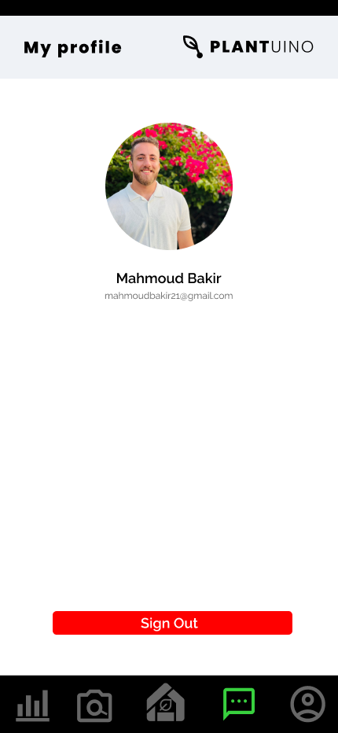

<br><br>

<!-- project philosophy -->

<br>

> Your go-to Arduino/mobile app for remote plant care.
>
> Offering plant recognition, AI ChatBot, and market updates

### User Stories

- As a user I want to view daily graphical analysis about my houseplant so I can review it’s progress.
- As a user, I want to chat with a bot, so I can know more about my houseplant.
- As a user I want to capture an image of a plant so that I can have information about it.
- As a user I want to buy other houseplants so that I can engrow my lovely garden.
- As a user I want to recieve push notifications so that I can be informed about my hosseplant status.

<br><br>

<!-- Prototyping -->


> I designed Plantuino using mockups, iterating on the design until I reached the ideal layout for easy navigation and an unforgettable user experience.

### Mockups

#### Authentication Screens

| Login screen                              | Singup Screen                            |
| ----------------------------------------- | ---------------------------------------- |
|  |  |

<br><br>

#### Owners Screens

| Home Screen                              | AI Recognition Screen          | Loading Screen                      |
| ---------------------------------------- | ------------------------------ | ----------------------------------- |
|  |  |  |

| Result Screen                        | Owner Home Screen (Updated)                       | Market                             |
| ------------------------------------ | ------------------------------------------------- | ---------------------------------- |
|  | .png>) |  |

| Contact Modal                              | ChatScreen (Empty)                    | Chat                             |
| ------------------------------------------ | ------------------------------------- | -------------------------------- |
|  |  |  |

| Notifications                               | Analytics (Empty)                          | Analytics                              |
| ------------------------------------------- | ------------------------------------------ | -------------------------------------- |
|  |  |  |

#### Sellers Screens

| My Market                              | EditModal                             | Editing                             |
| -------------------------------------- | ------------------------------------- | ----------------------------------- |
|  |  |  |

<br><br>

#### Profile Screen

| Profile |
| ------- |



<br><br>

<!-- Implementation -->


> Using the mockups as a guide, I implemented the Plantuino app with the following features:

### User Screens (Mobile)

| Login screen                              | Register screen                         | Landing screen                          | Loading screen                          |
| ----------------------------------------- | --------------------------------------- | --------------------------------------- | --------------------------------------- |
|  |  |  |  |
| Home screen                               | Menu Screen                             | Order Screen                            | Checkout Screen                         |
|  |  |  |  |

#### Admin Screens (Web)

| Login screen                            | Register screen                       | Landing screen                        |
| --------------------------------------- | ------------------------------------- | ------------------------------------- |
|  |  |  |
| Home screen                             | Menu Screen                           | Order Screen                          |
|  |  |  |

<br><br>

<!-- Tech stack -->


### EcoTech is built using the following technologies:

## Frontend (Mobile App)

<a name="Frontend" ></a>

- **[React Native (Expo)](https://expo.dev/):** Used for cross-platform mobile app development.
- **[Expo Packages](https://docs.expo.dev/workflow/using-libraries/):** Various Expo packages for accessing device features and UI components.
- **[Redux Toolkit](https://redux-toolkit.js.org/):** Manages app data and state effectively.development.
- **[Native Notify](https://nativenotify.com/):** Handles push notifications.development.
- **React Navigation:** Handles navigation within the app.
- **Axios:** Enables network requests to the backend.

<br>

- This project uses:[NodeJS](https://nodejs.org/en). React Native is an open-source framework for building mobile applications. It's developed and maintained by Facebook and the React community. React Native allows developers to use JavaScript and React to build mobile applications that run on iOS and Android devices.
- For persistent storage (database), the app uses the [MongoDB](https://www.mongodb.com/) package which allows the app to create a custom storage schema and save it to a local database.
- To send local push notifications, the app uses the [Native Notify](https://nativenotify.com/) package which supports Android, iOS.
- For ChatBot, The app uses [OpenAI API](https://openai.com/blog/openai-api) which is responsible of generating answers to users questions.
- For AI Recognition, The app uses [Plant.id](https://plant.id/) API which is responsible of identifying the name of the photographed plant through uploading an image.
- To store users information, The app uses [Redux ToolKit] (https://redux-toolkit.js.org/) package which is capable of creating reducers for each type of information that needs to be saved.
- This app uses the font ["Raleway"](https://fonts.google.com/specimen/Raleway) as its main font and the fonto ["Robot"](https://fonts.google.com/specimen/Roboto) as a font for numbers.The design of the app adheres to the material design guidelines.

<br><br>

<!-- How to run -->


> To set up Coffee Express locally, follow these steps:

### Prerequisites

This is an example of how to list things you need to use the software and how to install them.

- npm
  ```sh
  npm install npm@latest -g
  ```

### Installation

_Below is an example of how you can instruct your audience on installing and setting up your app. This template doesn't rely on any external dependencies or services._

1. Get a free API Key at [https://example.com](https://example.com)
2. Clone the repo
   ```sh
   git clone https://github.com/your_username_/Project-Name.git
   ```
3. Install NPM packages
   ```sh
   npm install
   ```
4. Enter your API in `config.js`
   ```js
   const API_KEY = "ENTER YOUR API";
   ```

Now, you should be able to run Coffee Express locally and explore its features.
