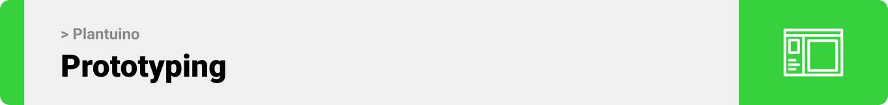
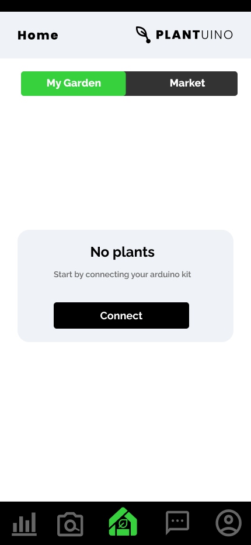
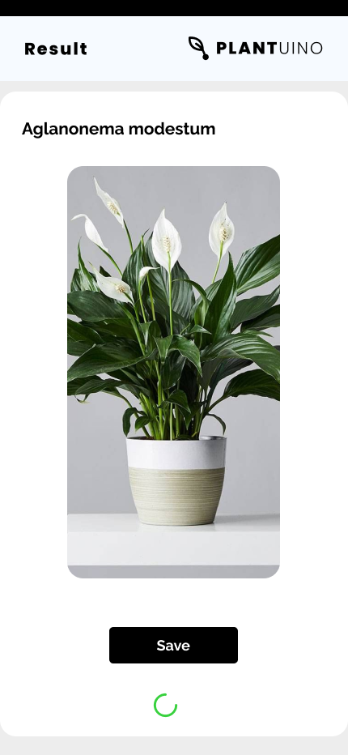
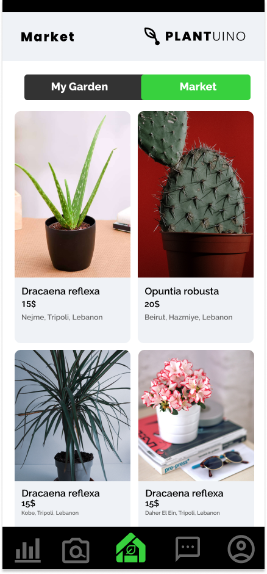
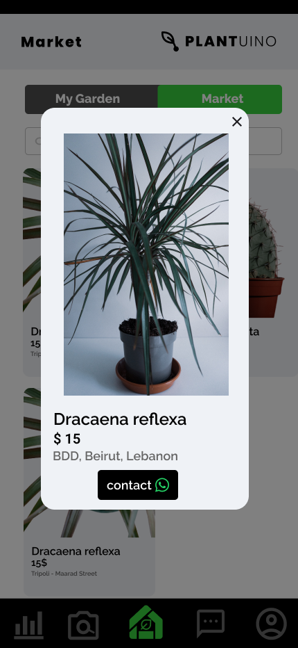
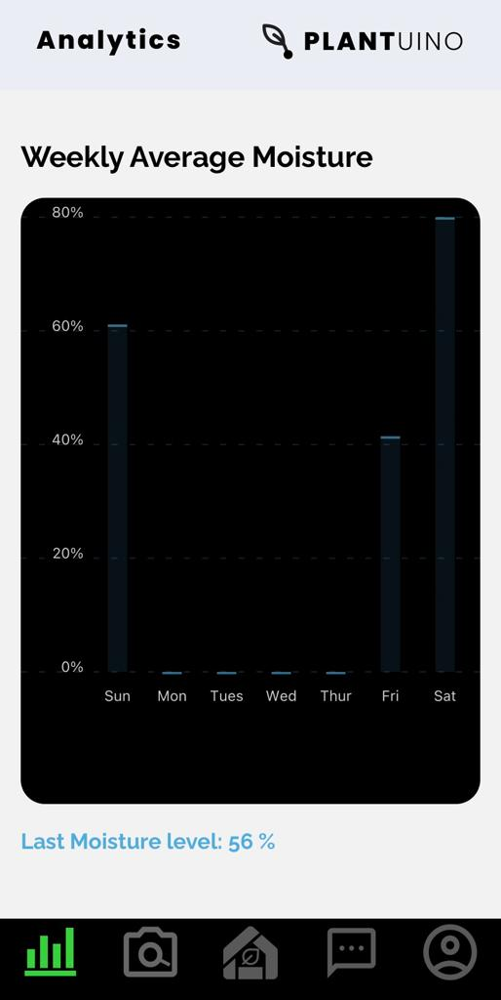
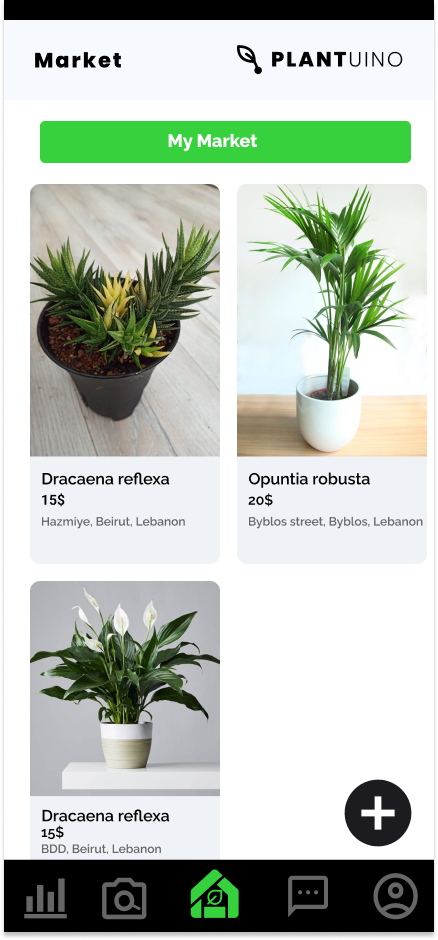

<br><br>


- [Project Description](#project-description)
- [User Types](#user-types)
- [Features of the App](#features-of-the-app)
- [Tech Stack](#tech-stack)
  - [Frontend](#end)
  - [Backend](#Backend)
- [Prototyping](#prototyping)
- [Demo](#Demo)
- [OpenAi](#OpenAi)
- [Performance](#Performance)
- [How to Run](#how-to-run)
  - [Prerequisites](#prerequisites)
  - [Installation](#installation)

<br><br>

<!-- project philosophy -->

<a name="project-description"></a>


> Your go-to Arduino/mobile app for remote plant care while offering plant recognition, AI ChatBot, and market updates

<br>

### Project Description
Plantuino's primary goal is to help Plant Owners nurture their House Plants in a hybrid way by collecting vital data such as light,and moisture percentages and thus notifying the user about the plant's state. This data is gathered through sensors connected to an Arduino and sent to the mobile app that, after AI analysis of the plant type, compares it to its favorabile light and moisture percentages. If a deficiency or excess of light or moisture is detected, the app sends real-time notifications to the Plant Owner.Moreover, the arduino is responsible of supplying water to the plant if needed.The average moisture and light percentages are presented in charts that dynamically inform the user of the plant's moisture and light present percentages.Also, The app offers the feature of chatting with a ChatBot that can answer any of users' questions.
<br><br>
On a secondary level, the app connects Plant Owners to Plant Sellers and vice-versa through embeded markets; Plant Owners have the access to view Sellers products uploaded.
<br><br>
In addition, An Admin Dashboard is implemented to be able to view, edit, and delete users.
<br><br>

### User Types 

1. Plant Owner 
2. Seller
3. Admin


<br>

### Features of the App 
As a Plant Owner:
- View daily graphical analysis about my houseplant so I can review it’s progress.
- Chat with a bot, so I can know more about my houseplant.
- Identify type of a plant so that I can have information about it.
- Buy other houseplants so that I can engrow my lovely garden.
- Recieve push notifications so that I can be informed about my hosseplant status.

As a Seller:
- Upload new products on my store so I can sell them to clients.
- Edit products details so that I can change them whenever I want.
- Delete a product so that it won't show to clients.

As an Admin:
- View All and specific type of users so that I can check for app activity.
- Create a new users so that I can add them to the community.
- Have access to edit actions so that I change user details 
- Have access to delete actions so that I can remove users

<br><br>

<!-- Prototyping -->
<a name="prototyping"></a>



> I designed Plantuino using mockups, iterating on the design until I reached the ideal layout for easy navigation and an unforgettable user experience.

### Mockups

#### Authentication Screens

| Signin screen                              | Register Screen                            |
| ----------------------------------------- | ---------------------------------------- |
|  |  |

<br><br>

#### Owners Screens

| Home Screen                              | AI Recognition Screen          | Loading Screen                      |
| ---------------------------------------- | ------------------------------ | ----------------------------------- |
|  |  |  |

| Result Screen                        | Owner Home Screen (Updated)                       | Market                             |
| ------------------------------------ | ------------------------------------------------- | ---------------------------------- |
|  | .png) |  |

| Contact Modal                              | ChatScreen (Empty)                    | Chat                             |
| ------------------------------------------ | ------------------------------------- | -------------------------------- |
|  |  |  |

| Notifications                               | Analytics (Empty)                          | Analytics                              |
| ------------------------------------------- | ------------------------------------------ | -------------------------------------- |
|  |  |  |

#### Sellers Screens

| My Market                              | EditModal                             | Editing                             |
| -------------------------------------- | ------------------------------------- | ----------------------------------- |
|  |  |  |

<br><br>

#### Profile Screen

| My Market                              |                            |                           |
| -------------------------------------- | ------------------------------------- | ----------------------------------- |
|  | 

<br><br>

<!-- Implementation -->

<a name="Demo" ></a>


> Using the mockups as a guide, I implemented the Plantuino app with the following features:

### User Screens (Mobile)

| Login screen                              | Register screen                         | Recognition Screen                         | Loading screen                          |
| ----------------------------------------- | --------------------------------------- | --------------------------------------- | --------------------------------------- |
|  |  |  |  |
| Public Market                               | Contact Modal                             | Chat Screen                            | Chart Screen                         |
|  |  |  |  | |
| Charts                              | Dynamic Charts                              | Add product Screen                            | Edit Product                         |
|  |  |  |  
| Delete Product                              | Profile                         
|  |  

#### Admin Screens (Web)

| Login screen                            | Register screen                       | Landing screen                        |
| --------------------------------------- | ------------------------------------- | ------------------------------------- |
|  |  |  |
| Home screen                             | Menu Screen                           | Order Screen                          |
|  |  |  |

<br><br>

<!-- Tech stack -->
<a name="tech-stack" ></a>

>The application utilizes React Native (Expo) for the mobile app, Node.js with Express for the backend, MongoDB Atlas for database storage, AWS server for cloud infrastructure, Arduino for sensor data collection, OpenAI for ChatBot and Analysis,plant.id API for plant Recognition, and Native Notify for real-time notifications.
<br>
Plantuino is built using the following technologies:
## Frontend
<a name="Frontend" ></a>
- **[React Native (Expo)](https://expo.dev/):** Used for cross-platform mobile app development.
- **[Expo Packages](https://docs.expo.dev/workflow/using-libraries/):** Various Expo packages for accessing device features and UI components.
- **[Redux Toolkit](https://redux-toolkit.js.org/):** Manages app data and state effectively.development.
- **[Native Notify](https://nativenotify.com/):** Handles push notifications.development.
- **React Navigation:** Handles navigation within the app.
- **Axios:** Enables network requests to the backend.
  <br>

## Backend
<a name="Backend" ></a>

- **[Node.js](https://expo.dev/) with Express:**  Powers the backend server for API requests and logic.
- **Mongoose:** Object Data Modeling (ODM) library for MongoDB.
- **[MongoDB Atlas ](https://www.mongodb.com/):**  Cloud-based database service for data storage.
- **AWS (Amazon Web Services):** Cloud infrastructure for hosting the server and application.
- **Arduino:** Utilized for sensor data collection in the field.
- **OpenAI API:** Empowers ChatBot and Analysis.
- **Native Notify:** Used for real-time notifications.
EcoTech utilizes these technologies to provide a seamless and comprehensive wildfire prevention and community engagement experience.


<!-- How to run -->


> To set up Coffee Express locally, follow these steps:

### Prerequisites

This is an example of how to list things you need to use the software and how to install them.

- npm
  ```sh
  npm install npm@latest -g
  ```

### Installation

_Below is an example of how you can instruct your audience on installing and setting up your app. This template doesn't rely on any external dependencies or services._

1. Get a free API Key at [https://example.com](https://example.com)
2. Clone the repo
   ```sh
   git clone https://github.com/your_username_/Project-Name.git
   ```
3. Install NPM packages
   ```sh
   npm install
   ```
4. Enter your API in `config.js`
   ```js
   const API_KEY = "ENTER YOUR API";
   ```

Now, you should be able to run Coffee Express locally and explore its features.
