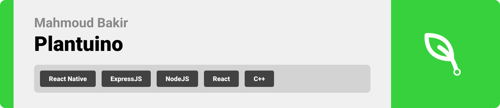
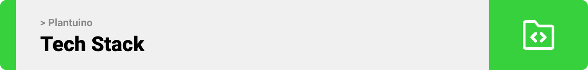

<br><br>

<!-- project philosophy -->

<br>

> Your go-to Arduino/mobile app for remote plant care.
>
> Offering plant recognition, AI ChatBot, and market updates

### User Stories

- As a user I want to view daily graphical analysis about my houseplant so I can review it’s progress.
- As a user, I want to chat with a bot, so I can know more about my houseplant.
- As a user I want to capture an image of a plant so that I can have information about it.
- As a user I want to buy other houseplants so that I can engrow my lovely garden.
- As a user I want to recieve push notifications so that I can be informed about my hosseplant status.

<br><br>

<!-- Prototyping -->


> I designed Plantuino using mockups, iterating on the design until I reached the ideal layout for easy navigation and an unforgettable user experience.

### Mockups

- Authentication Screens

| Login screen                       | Singup Screen                     |
| ---------------------------------- | --------------------------------- |
|  |  |

<br><br>

- Owners Screens

| Home Screen                       | AI Recognition Screen   | Loading Screen               |
| --------------------------------- | ----------------------- | ---------------------------- |
|  |  |  |


| Result Screen                 | Owner Home Screen (Updated)                 | Market                      |
| ----------------------------- | ------------------------------------------ | --------------------------- |
|  | .png>) |  |


| Contact Modal              | ChatScreen (Empty)                | Chat                      |
| -------------------------------- | ------------------------- | --------------------------- |
|  |  |  |


| Notifications              | Analytics (Empty)                | Analytics                      |
| -------------------------------- | ------------------------- | --------------------------- |
|  |  |  |

- Sellers Screens

| My Market             | EditModal                | Market                      |
| -------------------------------- | ------------------------- | --------------------------- |
|  |  |  |

<br><br>
- Common Screens

| ChatScreen (empty)               | ChatScreen                | Market                      |
| -------------------------------- | ------------------------- | --------------------------- |
|  |  |  |

<!-- Implementation -->


> Using the wireframes and mockups as a guide, we implemented the Coffee Express app with the following features:

### User Screens (Mobile)

| Login screen                              | Register screen                         | Landing screen                          | Loading screen                          |
| ----------------------------------------- | --------------------------------------- | --------------------------------------- | --------------------------------------- |
|  |  |  |  |
| Home screen                               | Menu Screen                             | Order Screen                            | Checkout Screen                         |
|  |  |  |  |

### Admin Screens (Web)

| Login screen                            | Register screen                       | Landing screen                        |
| --------------------------------------- | ------------------------------------- | ------------------------------------- |
|  |  |  |
| Home screen                             | Menu Screen                           | Order Screen                          |
|  |  |  |

<br><br>

<!-- Tech stack -->


### Coffee Express is built using the following technologies:

- This project uses the [Flutter app development framework](https://flutter.dev/). Flutter is a cross-platform hybrid app development platform which allows us to use a single codebase for apps on mobile, desktop, and the web.
- For persistent storage (database), the app uses the [Hive](https://hivedb.dev/) package which allows the app to create a custom storage schema and save it to a local database.
- To send local push notifications, the app uses the [flutter_local_notifications](https://pub.dev/packages/flutter_local_notifications) package which supports Android, iOS, and macOS.
  - 🚨 Currently, notifications aren't working on macOS. This is a known issue that we are working to resolve!
- The app uses the font ["Work Sans"](https://fonts.google.com/specimen/Work+Sans) as its main font, and the design of the app adheres to the material design guidelines.

<br><br>

<!-- How to run -->


> To set up Coffee Express locally, follow these steps:

### Prerequisites

This is an example of how to list things you need to use the software and how to install them.

- npm
  ```sh
  npm install npm@latest -g
  ```

### Installation

_Below is an example of how you can instruct your audience on installing and setting up your app. This template doesn't rely on any external dependencies or services._

1. Get a free API Key at [https://example.com](https://example.com)
2. Clone the repo
   ```sh
   git clone https://github.com/your_username_/Project-Name.git
   ```
3. Install NPM packages
   ```sh
   npm install
   ```
4. Enter your API in `config.js`
   ```js
   const API_KEY = "ENTER YOUR API";
   ```

Now, you should be able to run Coffee Express locally and explore its features.
